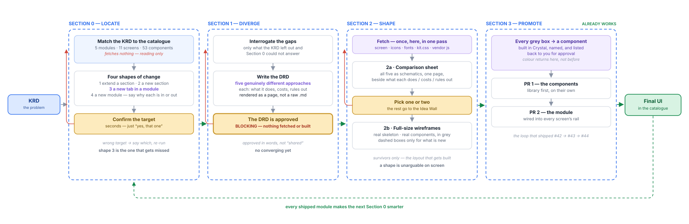

# The design method

How a problem becomes a page. Four sections, **one** blocking gate.

This file is the instruction set behind the `slipstream` skill. Reading it is
enough to run the method by hand; the skill just removes the fetching.



---

## Section 0 — Locate

**Automatic. No human input except a confirmation. Fetches nothing.**

> Section 0 is reading and discussion. The pack is all you need — no screen
> files, no icons, no fonts, no stylesheet. Those come in **one batched pass**
> later, once the DRD has been approved and there is something to build
> against. Fetching early spends the user's time on files that may belong to
> a screen they are about to rule out.

Before anything is designed, establish what already exists. Skipping this is
how approaches get invented in a vacuum and the final UI lands off-spec.

1. Read [pages.md](pages.md) and [components.md](components.md).
2. Match the KRD against them.
3. Produce candidates — **and candidates are shapes of change, not only
   screens.** Walk all four, in this order, and say why each is in or out:

   | # | shape | looks like |
   |---|---|---|
   | 1 | extend a section on an existing screen | a field, a column, a state |
   | 2 | a new section on an existing screen | its own heading and data scope |
   | 3 | **a new screen inside an existing module** | **a tab — `tabs` already exists and two modules use it** |
   | 4 | a new module | nothing in the rail fits |

4. Name the conventions that will bind this work: the framework, the layout
   rules, the relevant foundations.

**Gate — confirm the target.** Seconds, not a review. "Yes, that one," or
"no, it's X." If wrong, re-run with the correction.

> Never present a single confident answer. One option invites acceptance of a
> wrong one; several invite a decision.

> **Shape 3 is the one that gets missed.** It was missed on the very first
> real run. Two traps cause it, and both are easy to fall into again:
>
> - **Reading a screen's `notHere` as the module's.** `notHere` is scoped to
>   **one screen**. "DC Capacity does not show per-pilot detail" excludes it
>   from *that screen*, and says nothing about a second screen in the same
>   module. A new tab is a new screen, so the exclusion never applied to it.
> - **Reading the module's current shape instead of the catalogue's patterns.**
>   A module having no tabs today is not evidence against a tab. Check
>   [components.md](components.md) for what is available, not the target page
>   for what it happens to use.

## Section 1 — Diverge

**You drive. The DRD is a blocking gate: nothing is built until it is approved.**

> This was non-blocking in the first version, to protect cycle time. After a
> real run it was changed: the DRD was skipped, wireframes were built against
> nothing written down, and an approach nobody had considered turned out to be
> the right one. **The gate is worth the day.**

1. **Interrogate the gaps** — ask only what the KRD left out *and* Section 0
   could not answer. Do not re-ask what the catalogue already knows.
2. **Write the DRD** — `DRD.md` as the source, then render it to a page and
   **open it in the browser**:

   ```bash
   python3 scripts/render_doc.py DRD.md
   ```

   Handing over a raw `.md` hands over the *source* of a document, not the
   document. It reads badly, and approving it feels like reviewing a diff.

3. **Five approaches.** Genuinely different ways to solve the problem, not one
   idea in five costumes. For each: what it does, what it costs, what it rules
   out. If two collapse into the same thing, say so and find another — do not
   quietly ship four.

4. **Do not converge yet.** Converging here is what makes the whole exercise
   theatre: the shapes are compared as sentences, when the thing that actually
   decides it is seeing them laid out.

> **Approach ≠ IA.** Diverge here on *what we do about the problem* — surface it
> on an existing screen, give it a dedicated page, make it a notification.
> Structure comes next. Diverging on both axes at once gives fifteen options
> that are really three, and nobody can review that.

**Gate — the DRD is approved.** Hard stop. Not "shared", not "sent" —
approved, in words, by the person who asked for the work. Revise and re-render
until they say it is good to go.

Only then does anything get fetched or built.

## Section 2 — Shape

**Starts only after the DRD is approved.** This is where the real gate is.

**Fetch once, here.** One batched pass for everything the build needs — the
screen, only the icons it references, the three fonts, `kit.css`, and any
vendor script its markup links. Not before, not drip-fed.

Two artefacts, in order. Each does a job the other is bad at.

### 2a — the comparison sheet

**All five approaches on one page**, each a small schematic beside what it
does, what it costs, and what it rules out. Build it with the `wfc-` classes
in `wireframe.css`; [comparison-example.html](comparison-example.html) is the
standard.

Schematic on purpose: at this stage the question is *which shape*, not *is
this spacing right*. Five full-size pages is too much scrolling to compare,
which is exactly why they are small here.

**Gate — the reviewer picks one or two.**

### 2b — full-size wireframes for the survivors

Only now, and only for what survived. Real skeleton, real size, every existing
component shown in grey — because this is the layout that is about to be
built, and layout problems that surface after promotion are expensive.

If a surviving approach has more than one sensible IA, **say so and ask**
rather than picking one quietly.

1. **IA outline first** — header, then sections in order, then what is in each.
   Check it against [section-rules.md](section-rules.md) before building.
2. **Build it grey**, on the real skeleton:

   ```html
   <link rel="stylesheet" href="../assets/kit.css">
   <link rel="stylesheet" href="../assets/wireframe.css">
   <div class="vp-scope wf"> … </div>
   ```

   `wireframe.css` remaps the colour tokens, so **every real component renders
   in grey, unchanged in structure, spacing and type**. If the catalogue has a
   stat bar, a table, tabs or the nav rail, show the real one — greyed. Never
   draw a box with `stat-summary-bar` written in it; a label naming a component
   tells a reviewer less than the component does.

   The rail is real and carries **every module**, not a two-item stub — a page
   has to look like a page inside the panel, not a prototype of the panel.

   Only things the catalogue does **not** have become a `.wf-box`, which leaves
   the dashed boxes as an exact list of what must be built. Label each one with
   **what the reader sees** — "where this DC stands" — never with a component
   name or a visual description.

   > **A wireframe is for choosing a shape, not for admiring a design.** The
   > first real run produced near-final pages — real components, real colour —
   > and reviewing them turned into proofreading instead of choosing. Colour
   > comes back at promotion, not before.

   A worked example is in [wireframe-example.html](wireframe-example.html) —
   open it rather than guessing what "grey box" means. Dashed border = new,
   solid = the catalogue already has it.

3. **Invent freely.** The catalogue never limits what can be proposed. A method
   that only permits existing components cannot produce a new idea.
4. **Publish for review** — a branch gives a preview link; full-page screenshots
   go to the Figma gallery, named `<branch>-<approach>` so any frame traces back
   to the wireframe that made it.

**Gate — reviewers pick one.** The only gate that stops work. Changes loop back
to that wireframe.

Losing wireframes go to the **Idea Wall** (`log-exploration`): logged, never
reviewed, allowed to go stale. Dead ends are the reason the wall exists.

## Section 3 — Promote

**This half already works — it is the loop that shipped PRs #42 → #43 → #44.**

1. **Every grey box becomes a real component.** Built properly in Crystal
   tokens, named, and **listed back to you for approval** — so additions to the
   library are a decision, not something discovered later.
2. **PR 1 — the components**, on their own. The library gets them first, so
   nothing depends on something that is not upstream yet.
3. **PR 2 — the module**, wired into every screen's rail.
4. Regenerate: `build_docs.py`, `export_to_github.py`, `check_v2_sync.py`.

The shipped module is now part of the catalogue, so the next Section 0 is
better than this one. **That is the feedback loop** — and it only stays healthy
if promoting is cheap. The moment it becomes a chore, the catalogue starts
decaying.

---

## Where each gate actually is

| section | gate | blocking? |
|---|---|---|
| 0 Locate | confirm the target | yes, but seconds |
| 1 Diverge | **the DRD is approved** | **yes — nothing is fetched or built until it is** |
| 2 Shape | **reviewers pick a wireframe** | yes |
| 3 Promote | approve the new components | yes, minutes |

## What this method assumes you have read

[page-framework.md](page-framework.md) · [layout-rules.md](layout-rules.md) ·
[section-rules.md](section-rules.md) · [never-do-this.md](never-do-this.md) ·
the three foundations · [fidelity-checklist.md](fidelity-checklist.md)

The `slipstream` skill fetches all of these before Section 0.
